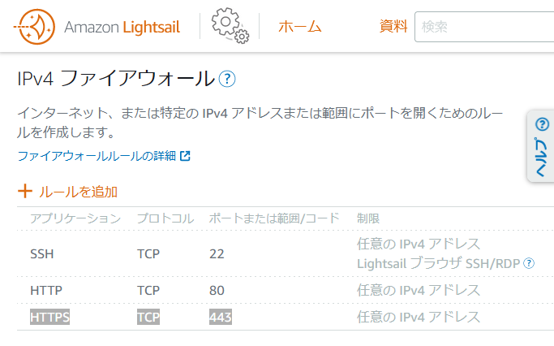
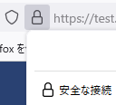

# <a name="pageTop"></a>Certbot Lets'Encrypt on Amazon Linux 2 install guide

作成日：2022/05/06<br>

このドキュメントは、Amazon Linux 2 にインストールした NGINX で ホストしている WebSite に HTTPS（暗号化通信）を利用出来るよう環境を構築する事を目的に書かれています。作成時より時が経つと書いている手順通りに出来なくなる可能性があります。

## 前提
+ NGINX を使用して HTTP(80ポート)で WebSiteをホストしてること。<br>-> [インストールガイド NGINX on Amazon Linux 2 install guide](NGINX-on-Amazon-Linux-2-install-guide.md) 

## 目次
+ [nginx.conf へ独自ドメインを設定する](#nginx_conf_domain)
+ [EPELリポジトリを有効にする](#epel)
+ [Certbot をインストールする](#certbot_install)
+ [Certbot を実行](#sudo_certbot)
+ [HTTPS TCP 443 のポートを開く](#443)
+ [証明書の自動更新を設定](#crontab)
+ [インストールの参考にした WebSite](#reference_website)
***
## <a name="nginx_conf_domain"></a>nginx.conf へ独自ドメインを設定する

nginx.conf を編集します。
```
sudo nano /etc/nginx/nginx.conf
```

```server_name  _;``` と書いている所の ```_``` を、独自ドメインに書き換え保存します。

変更前
```
    server {
        server_name  _;
```

変更後（```example.com``` を使用するドメイン名に読み替えてください）
```
    server {
        server_name  example.com;
```
NGINX コンフィグファイルの再読み込み
```
sudo systemctl reload nginx
```
独自ドメイン名にブラウザでアクセスし、正常に表示されたらOK

## <a name="epel"></a>EPEL リポジトリを有効にする
Certbot をインストールする前準備にEPEL リポジトリを有効にします。
```
sudo amazon-linux-extras install epel -y
```

応答
```
Installing epel-release
~~~
~~~
Installed:
  epel-release.noarch 0:7-11

Complete!
~~~
 24  epel=latest              enabled      [ =7.11  =stable ]
```

## <a name="certbot_install"></a>Certbot をインストールする
nginx に設定を出来るようオプションを指定して Certbot をインストールします。
```
sudo yum install -y certbot python2-certbot-nginx
```

応答
```
Loaded plugins: extras_suggestions, langpacks, priorities, update-motd
amzn2-core                                                                     | 3.7 kB  00:00:00
218 packages excluded due to repository priority protections
Resolving Dependencies
--> Running transaction check

~~~

Transaction Summary
======================================================================================================
Install  2 Packages (+26 Dependent packages)

~~~

Installed:
  certbot.noarch 0:1.11.0-2.el7              python2-certbot-nginx.noarch 0:1.11.0-1.el7

~~~

Complete!
```

## <a name="sudo_certbot"></a>Certbot を実行
Certbot を使用して、Lets'Encrypt を利用するに必要なファイル作成と nginx.conf の編集を自動で行います。
```example.com``` を使用するドメイン名に読み替えてください
```
sudo certbot --nginx -d example.com
```

応答、連絡の付くメールアドレスを入力します。
```
Saving debug log to /var/log/letsencrypt/letsencrypt.log
Plugins selected: Authenticator nginx, Installer nginx
Enter email address (used for urgent renewal and security notices)
 (Enter 'c' to cancel):
 ```

 応答、利用規約を読み同意が必要です。(Y)でok
 ```
 - - - - - - - - - - - - - - - - - - - - - - - - - - - - - - - - - - - - - - - -
Please read the Terms of Service at
https://letsencrypt.org/documents/LE-SA-v1.2-November-15-2017.pdf. You must
agree in order to register with the ACME server. Do you agree?
- - - - - - - - - - - - - - - - - - - - - - - - - - - - - - - - - - - - - - - -
(Y)es/(N)o:
 ```

 応答、EFFのニュースなどを購読するか聞かれます。(N)でok
 ```
 - - - - - - - - - - - - - - - - - - - - - - - - - - - - - - - - - - - - - - - -
Would you be willing, once your first certificate is successfully issued, to
share your email address with the Electronic Frontier Foundation, a founding
partner of the Let's Encrypt project and the non-profit organization that
develops Certbot? We'd like to send you email about our work encrypting the web,
EFF news, campaigns, and ways to support digital freedom.
- - - - - - - - - - - - - - - - - - - - - - - - - - - - - - - - - - - - - - - -
(Y)es/(N)o:
```

応答、アカウントが登録され、certbot による Let's Encrypt の設定が完了した。
```
Account registered.
Requesting a certificate for example.com
Performing the following challenges:
http-01 challenge for example.com
Waiting for verification...
Cleaning up challenges
Deploying Certificate to VirtualHost /etc/nginx/nginx.conf
Redirecting all traffic on port 80 to ssl in /etc/nginx/nginx.conf

- - - - - - - - - - - - - - - - - - - - - - - - - - - - - - - - - - - - - - - -
Congratulations! You have successfully enabled https://example.com
- - - - - - - - - - - - - - - - - - - - - - - - - - - - - - - - - - - - - - - -

IMPORTANT NOTES:
 - Congratulations! Your certificate and chain have been saved at:
   /etc/letsencrypt/live/example.com/fullchain.pem
   Your key file has been saved at:
   /etc/letsencrypt/live/example.com/privkey.pem
   Your certificate will expire on 2022-08-04. To obtain a new or
   tweaked version of this certificate in the future, simply run
   certbot again with the "certonly" option. To non-interactively
   renew *all* of your certificates, run "certbot renew"
 - If you like Certbot, please consider supporting our work by:

   Donating to ISRG / Let's Encrypt:   https://letsencrypt.org/donate
   Donating to EFF:                    https://eff.org/donate-le
```

nginx.conf が書き換えられたので、NGINX コンフィグファイルの再読み込みをします。
```
sudo systemctl reload nginx
```

## <a name="443"></a>HTTPS TCP 443 のポートを開く
インスタンス の ファイヤーウォール に HTTPS TCP 443 のポートを開くためのルールを追加します。




設定した独自ドメインへブラウザでアクセスする。



アドレスバーの先頭に鍵のアイコンが表示され、安全な接続となっていれば設定は完了です。


## <a name="crontab"></a>証明書の自動更新を設定
Certbot をcron に設定して自動で証明書の更新を行う。


```
cd /etc/
sudo nano crontab -e
```

応答
```
SHELL=/bin/bash
PATH=/sbin:/bin:/usr/sbin:/usr/bin
MAILTO=root

# For details see man 4 crontabs

# Example of job definition:
# .---------------- minute (0 - 59)
# |  .------------- hour (0 - 23)
# |  |  .---------- day of month (1 - 31)
# |  |  |  .------- month (1 - 12) OR jan,feb,mar,apr ...
# |  |  |  |  .---- day of week (0 - 6) (Sunday=0 or 7) OR sun,mon,tue,wed,thu,fri,sat
# |  |  |  |  |
# *  *  *  *  * user-name  command to be executed
```

以下の一行を書き足す。
```
34 4,16 *  *  * root       certbot renew --no-self-upgrade
```

書き足した `crontab`
```
SHELL=/bin/bash
PATH=/sbin:/bin:/usr/sbin:/usr/bin
MAILTO=root

# For details see man 4 crontabs

# Example of job definition:
# .---------------- minute (0 - 59)
# |  .------------- hour (0 - 23)
# |  |  .---------- day of month (1 - 31)
# |  |  |  .------- month (1 - 12) OR jan,feb,mar,apr ...
# |  |  |  |  .---- day of week (0 - 6) (Sunday=0 or 7) OR sun,mon,tue,wed,thu,fri,sat
# |  |  |  |  |
# *  *  *  *  * user-name  command to be executed
34 4,16 *  *  * root       certbot renew --no-self-upgrade
```
保存して閉じる。

`crond` を再起動します。
```
sudo systemctl restart crond
```

***
+ [pageTop](#pageTop)
+ [README](README.md)
***

><a name="reference_website"></a>**インストールの参考にした WebSite**<br>
>Amazon Linux を実行している Amazon EC2 インスタンスの EPEL リポジトリを有効にするにはどうすればよいですか?<br>
>https://aws.amazon.com/jp/premiumsupport/knowledge-center/ec2-enable-epel/<br>
>AWSEC2へのnginxとcertbotのインストール<br>
>https://techread.me/installing-nginx-and-certbot-on-aws-ec2/<br>
>チュートリアル: Certificate Automation: Amazon Linux 2 での Let's Encrypt と Certbot の使用<br>
>https://docs.aws.amazon.com/ja_jp/AWSEC2/latest/UserGuide/SSL-on-amazon-linux-2.html#letsencrypt

